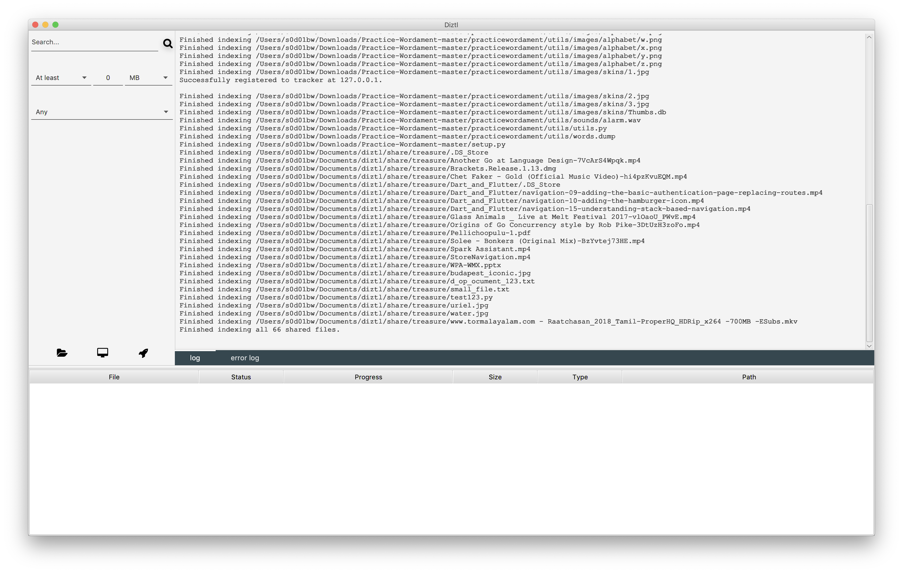
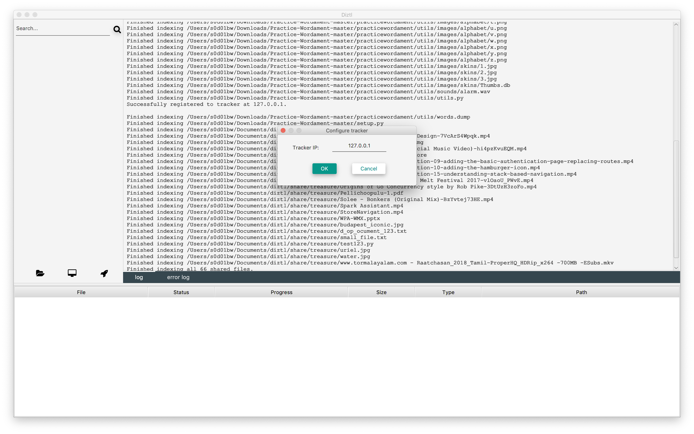
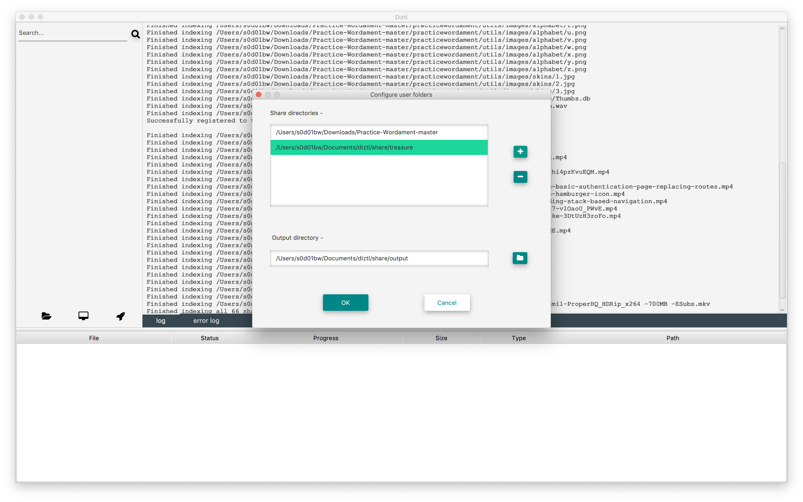
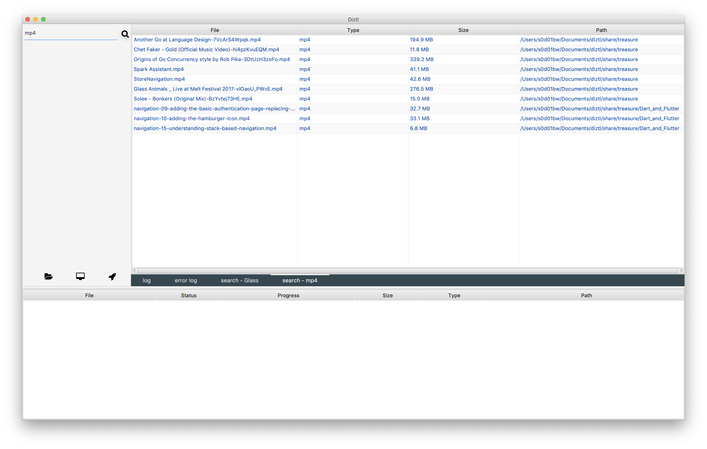
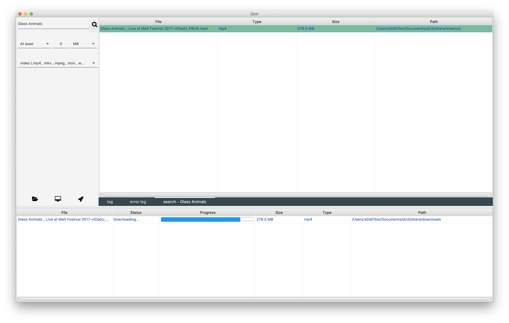
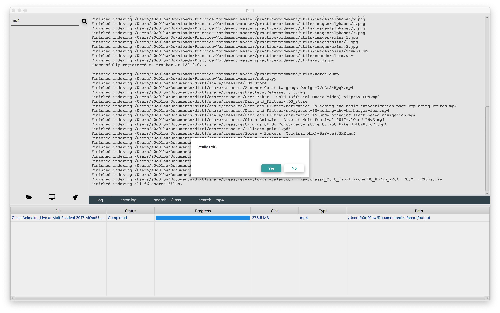

<p align="center">

</p>

# DIZTL

<p align="center">
<a href="https://godoc.org/github.com/gravetii/diztl"></a>
<a href="https://goreportcard.com/report/github.com/gravetii/diztl"></a>
<a href="https://opensource.org/licenses/MIT"></a>
<a href="https://www.paypal.me/sandeepdasika"></a>
<a href="https://gitter.im/diztl/community?utm_source=badge&utm_medium=badge&utm_campaign=pr-badge"></a>
<a href="http://hits.dwyl.io/gravetii/diztl"></a>
<a href="https://saythanks.io/to/gravetii"></a>
</p>

A peer-to-peer file discovery and sharing tool for LANs written in Go!

## Getting started
The diztl project is written in Go with the frontend implementation in Java using JavaFX. To get started, run the following commands:
```
go get -v github.com/gravetii/diztl/tracker
go get -v github.com/gravetii/diztl/node
```

Diztl requires Java 8 to be installed on the host machine for the UI to work.

## Configuration steps

- Make a copy of the `config-template.yml` which is a bare-bones configuration file for diztl, and name it `config.yml` - `cp config-template.yml config.yml`. The `config.yml` file is the actual config file required for diztl to work. If you want to make any changes to the configuration, this is the file you want to edit. Note that this file is untracked in the repo (unlike the `config-template.yml`) which ensures that changes specific to your environment aren't reflected publicly. If any changes are to be reflected publicly, they need to go into the `config-template.yml` file.
- Optionally, you can also add the `config.yml` entry in your `.git/info/exclude` file so that git doesn't prompt you to add it to the stage all the time.

## Running diztl

In the root folder of the project:
- `go run tracker/main.go`: This runs the tracker node on the localhost.
- Specify the local IP address of the `Tracker` in the `config.yml` file to allow `Node`s to connect to it.
- `go run node/main.go`: Run this anywhere on any machine in the network to fire up a `Node`.
- Fire up the UI (for this, currently, you'll have to build the code located in the `ui` folder and run it) and discover/share/download files in your network.

## Implementation
Diztl consists of two main components:
- Tracker: The `Tracker`'s responsibility is to allow co-ordination and communication between the different `Node`s.
- Node: A `Node` is basically any peer in the network. It can share resources as well as request for and download resources from other `Node`s in the network.

The current implementation isn't completely decentralized in that the search queries from a `Node` are sent to the `Tracker` which then broadcasts the request across all peers in the network, requesting them to reply back with the files they have that might be of interest to the caller `Node`.

Once the requesting `Node` decides on the file it wants to download from the target peer, communication happens solely between the two peers without any intervention from the `Tracker`.

When the `Node` first starts up, it indexes all the files to be shared in the default share folder located under `<user_root>/Documents/diztl/share`. By default, downloaded files are located under `/downloads` directory of the shared folder. The `Node` then connects to the `Tracker` and registers itself after which it can participate in the network and communicate with other nodes. The share and downloads folders can be configured by changing the corresponding configurations in the `config.yml` file (requires restart of tracker and/or node).

For the formats of different request-response structures, take a look at the `diztl/diztl.proto` file which contains the protobuf specifications as well as the gRPC service definitions.

The node UI is implemented in Java using JavaFX which communicates with the node's gRPC server to facilitate user actions.

## Built With
- gRPC: The project uses [gRPC](https://grpc.io/docs/) as its communication protocol along with protocol buffers as the data-interchange format.
- JFoenix: [JFoenix](https://github.com/jfoenixadmin/JFoenix) is the material design library for JavaFX.

## Screenshots








## Contributing
Please read CONTRIBUTING.md for details on our code of conduct, and the process for submitting pull requests to the project.

## Authors
- Sandeep Dasika


## License
This project is licensed under the MIT License - see the LICENSE.md file for details

---

<div>Icons made by <a href="https://www.flaticon.com/authors/kiranshastry" title="Kiranshastry">Kiranshastry</a> from <a href="https://www.flaticon.com/" 			    title="Flaticon">www.flaticon.com</a> is licensed by <a href="http://creativecommons.org/licenses/by/3.0/" 			    title="Creative Commons BY 3.0" target="_blank">CC 3.0 BY</a></div>
